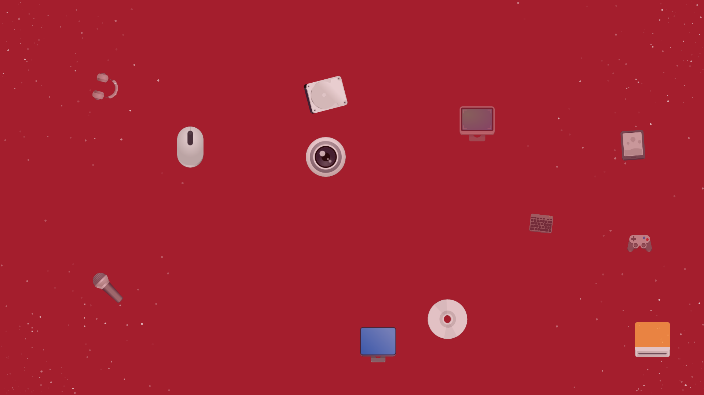
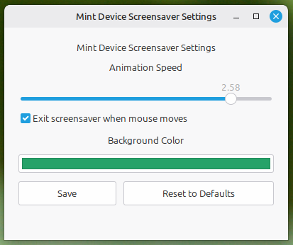
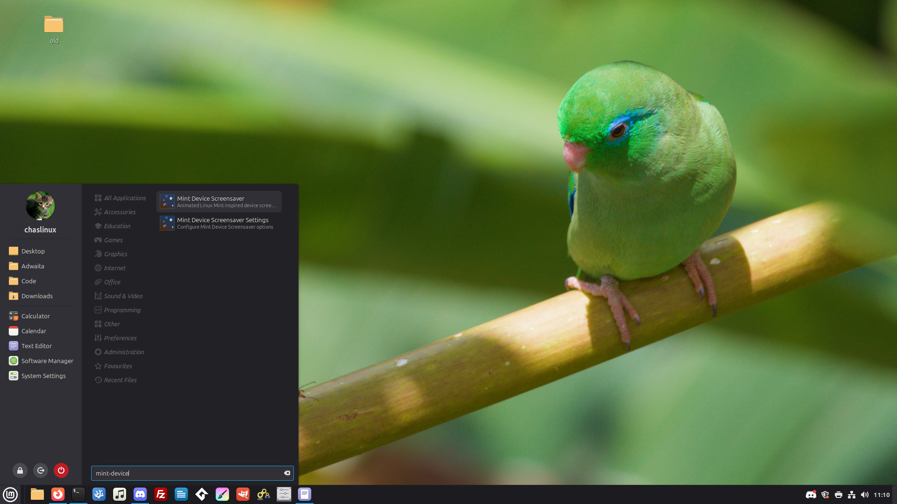

# Mint Device Screensaver

An animated device-themed screensaver for Linux Mint Cinnamon.



*Mint Device Screensaver showing animated device icons and particle effects.*

## Demo

https://github.com/user-attachments/assets/34cba14b-4e02-4ec5-94e4-344b980ff894

Mint Device Screensaver is a standalone visual screensaver application built with GTK and Clutter. It provides animated device icons, particles, and fullscreen visual effects while allowing Cinnamon to remain responsible for screen locking and authentication.

## Features

* Fullscreen animated screensaver window
* GTK and Clutter based rendering
* Floating SVG device icons
* Particle background effects
* Dynamic animated colour transitions
* Graphical settings application
* Configurable animation speed
* Custom background colour selection
* Persistent user configuration
* Optional Cinnamon screensaver integration
* Debian package support
* Application menu entry and icons
* Command-line tools for testing and configuration

### Screensaver


The screensaver provides animated device icons, particles, and changing background effects.

### Settings Application



The graphical settings application allows users to configure:

* Animation speed
* Background colour
* Mouse movement exit behavior
* Resetting preferences to defaults

### Menu Integration



Mint Device Screensaver installs as a normal Linux Mint application with menu entries for the screensaver and its settings.

### Colour Transitions


The selected background colour is used as the starting point before gradually transitioning into the animated background effects.

## Design

Mint Device Screensaver is designed as a **visual screensaver application**.

Cinnamon remains responsible for:

* Screen locking
* Password authentication
* Session security
* Unlock handling

Mint Device Screensaver provides only the visual screensaver experience.

The application does **not** replace the Cinnamon lock screen.

## Requirements

Tested on:

* Linux Mint 22.3 Cinnamon (64-bit)

Required system packages:

* Python 3
* GTK 3
* Clutter
* GtkClutter
* Cairo
* librsvg
* PyGObject (python3-gi)

## Installation

### Quick install

The easiest way to install from source:

```bash
git clone https://github.com/chaslinux/mint-device-screensaver.git
cd mint-device-screensaver
./install.sh
```

The installer will:

* install required dependencies
* build the Debian package
* install Mint Device Screensaver
* create application menu entries

The installer does **not** modify Cinnamon lock screen or authentication settings.

After installation, launch the application from the menu or:

```bash
mint-device-screensaver
```

Open the settings application:

```bash
mint-device-screensaver-settings
```

## Installing the Debian package

To build the package manually:

```bash
./debian/build-deb.sh
```

Install the generated package:

```bash
sudo dpkg -i ../mint-device-screensaver_*.deb
sudo apt install -f
```

## Running from source

For development testing:

```bash
./run.sh
```

This runs the application directly from the source tree without installing the package.

## Cinnamon Testing

Mint Device Screensaver can be tested manually:

```bash
cinnamon-screensaver-command --activate
```

To test normal Cinnamon locking:

```text
Ctrl + Alt + L
```

Cinnamon should continue to display its normal lock screen and handle authentication.

## Command Line Options

Show help:

```bash
mint-device-screensaver --help
```

Show version:

```bash
mint-device-screensaver --version
```

Display current configuration:

```bash
mint-device-screensaver --show-config
```

Reset configuration:

```bash
mint-device-screensaver --reset-config
```

Enable debug logging:

```bash
mint-device-screensaver --debug
```

## Configuration

Mint Device Screensaver includes a graphical settings application:

```bash
mint-device-screensaver-settings
```

User configuration is stored at:

```text
~/.config/mint-device-screensaver/config.ini
```

Available configuration options include:

* Animation speed
* Background colour
* Mouse exit behavior

Most users should configure the application through the settings window rather than editing the configuration file manually.

## Logs

Runtime logs are stored at:

```text
~/.local/state/mint-device-screensaver/mint-device-screensaver.log
```

## Development

Install development dependencies:

```bash
./install-dependencies.sh
```

Run from source:

```bash
./run.sh
```

Build the Debian package:

```bash
./debian/build-deb.sh
```

## Project Structure

```text
mint-device-screensaver/
├── data/
│   ├── applications/
│   ├── icons/
│   └── config/
├── debian/
│   ├── build-deb.sh
│   └── packaging files
├── docs/
│   └── screenshots/
├── src/
│   ├── application.py
│   ├── animation.py
│   ├── config.py
│   ├── scene.py
│   ├── stage.py
│   └── supporting modules
├── install.sh
├── install-dependencies.sh
├── mint-device-screensaver
└── run.sh
```

## License

This project is licensed under the GNU General Public License v3.0 or later.

See the `LICENSE` file for details.

## Status

Current release:

```text
Mint Device Screensaver 0.10.4 (development)
```

The project is focused on providing a stable, customizable standalone screensaver experience for Linux Mint Cinnamon.

